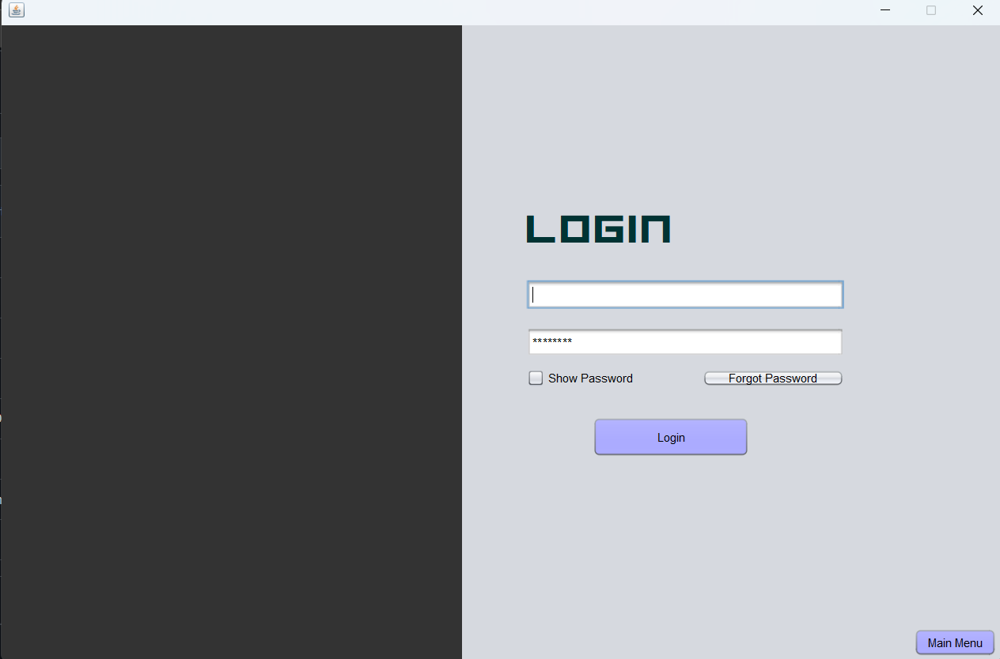
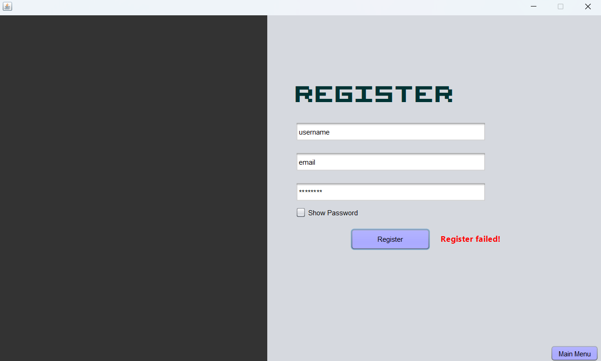
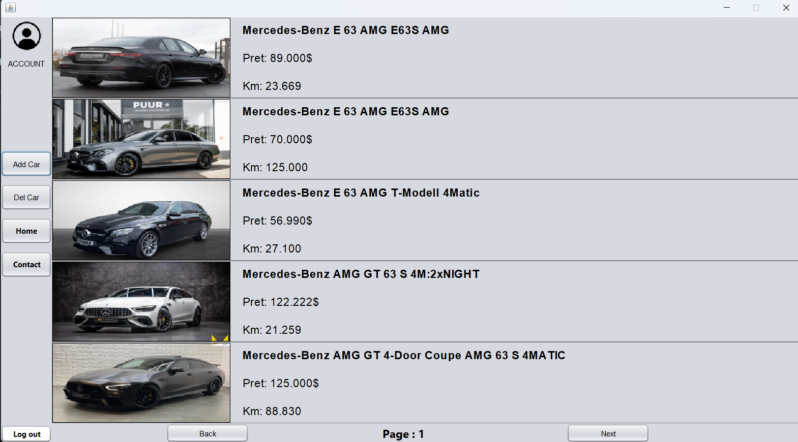
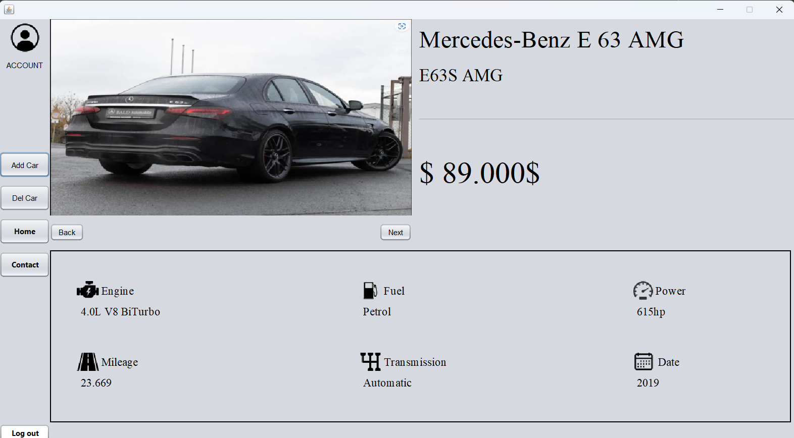

# Automotive Classifieds App

This project is a robust automotive classifieds platform built using Java and Swing. It provides a user-friendly interface for seamless browsing and management of car listings.

## Features

1. **Graphical User Interface**
   - Built with Swing, the application offers a responsive and intuitive design for a smooth user experience.

2. **Account Management**
   - Includes a comprehensive user account system with email-based activation to ensure secure and verified access.

3. **Admin Panel**
   - Features a dedicated administration interface that allows administrators to easily add and remove car listings for effective content management.

4. **Main Panel Display**
   - Prominently displays car listings on the main panel, offering users an intuitive browsing experience with access to all available options.

## How to Use

1. **Launch the Application**: Start the application to access the automotive classifieds platform.
2. **Create an Account**: Register a new account and activate it through email verification.
3. **Browse Listings**: Use the main panel to view car listings and explore available options.
4. **Admin Management** (for administrators): Log in to the admin panel to add, remove, or manage car listings.

## Screenshots






## Requirements
- Java 11+
- Libraries:
  - `swing` for GUI
  - `jakarta.mail` for email-based activation

## Installation

1. Clone the repository:
   ```bash
   git clone https://github.com/yourusername/automotive-classifieds-app.git
