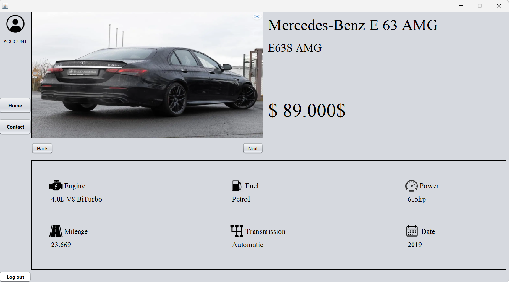

# CarSales

## Overview
CarSales is a robust automotive classifieds platform designed to connect buyers and sellers of vehicles efficiently and securely. The application provides an intuitive and visually appealing interface, powered by Java Swing, to ensure seamless user interaction.

## Features

### 1. **Graphical User Interface**
- Developed using Java Swing.
- Offers a responsive and user-friendly design for a smooth and engaging user experience.

### 2. **Account Management**
- Comprehensive user account system.
- Includes email-based activation to ensure secure and verified access.

### 3. **Admin Panel**
- Dedicated administration interface.
- Allows administrators to add and remove car listings effortlessly.
- Ensures effective management of the platform’s content.

### 4. **Main Panel Display**
- Prominently displays car listings on the main panel.
- Provides an intuitive browsing experience.
- Grants users easy access to all available options.

### Screenshots

  
  

  
  

## Usage
1. Launch the application.
2. Create a user account and activate it via the email verification process.
3. Browse car listings or log in as an admin to manage listings.

## Development
- **Language**: Java
- **Framework**: Swing (GUI)

## Author
- **Date**: November 2024
- Developed with passion for efficient and user-friendly automotive solutions.
